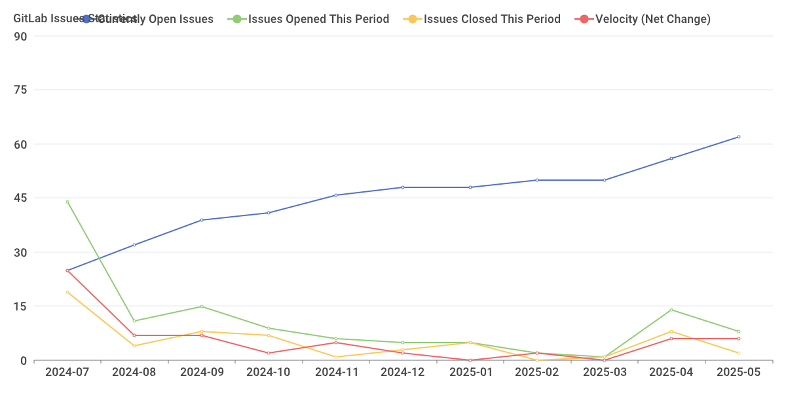

[](https://goreportcard.com/report/github.com/sgaunet/gitlab-stats)
[](https://github.com/sgaunet/gitlab-stats/releases/latest)

[](https://codeclimate.com/github/sgaunet/gitlab-stats/maintainability)
[](LICENSE)

# gitlab-stats

gitlab-stats is a tool to register stats of gitlab projects/groups. Based on the statistics saved, it can generate a graph to visualize the activity on gitlab projects/groups.

Example:



Actually, the stats are saved in $HOME/.gitlab-stats/db.json.

To register stats, you need to add cron, for example: 

```
00 00 * * * GITLAB_TOKEN=.... /usr/local/bin/gitlab-stats -g <groupID>   # comment
```

To generate the screenshot, you can also add a cron or execute it in the command line. Example of a cron:

```
00 00 1 * * /usr/local/bin/gitlab-stats -g <groupID> -o stats-`date "+%Y-%m" -d "1 day ago"`.png
```


# Usage

```
$ gitlab-stats -h
Usage of gitlab-stats:
  -d string
        Debug level (info,warn,debug) (default "error")
  -g int
        Group ID to get issues from (not compatible with -p option)
  -o string
        file path to generate statistic graph (do not fullfill DB)
  -p int
        Project ID to get issues from
  -s int
        since (default 6)
  -v    Get version
```

# Development

## prerequisites

This project is using :

* golang
* [task for development](https://taskfile.dev/#/)
* [goreleaser](https://goreleaser.com/)
* [pre-commit](https://pre-commit.com/)

There are hooks executed in the precommit stage. Once the project cloned on your disk, please install pre-commit:

```
brew install pre-commit
```

Install tools:

```
task install-prereq
```

And install the hooks:

```
task install-pre-commit
```

If you like to launch manually the pre-commmit hook:

```
task pre-commit
```


sudo apt install sqlite3 sqlite3-tools